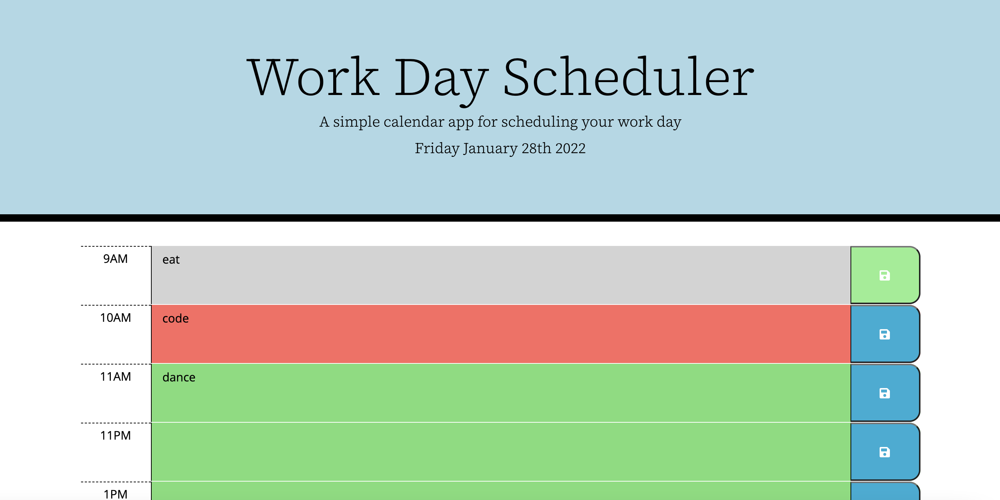

## My Work Day Planner 

## Link to Deployed Assets

## Overview 
I created a simple calendar application that allows a user to save events for each hour of the work day by modifying starter code. This ap features dynamically updated HTML and CSS powered by jQuery.

## User Story
```md
AS AN employee with a busy schedule
I WANT to add important events to a daily planner
SO THAT I can manage my time effectively
```

## Acceptance Criteria
```md
GIVEN I am using a daily planner to create a schedule
WHEN I open the planner
THEN the current day is displayed at the top of the calendar
WHEN I scroll down
THEN I am presented with timeblocks for standard business hours
WHEN I view the timeblocks for that day
THEN each timeblock is color coded to indicate whether it is in the past, present, or future
WHEN I click into a timeblock
THEN I can enter an event
WHEN I click the save button for that timeblock
THEN the text for that event is saved in local storage
WHEN I refresh the page
THEN the saved events persist
```

## How This Was Achieved
<ul>
<li>Using JavaScript, the user is able to open the application and see the current day displayed at the top of the calendar.</li>
<li>By adding timeblocks into the HTML, the user can view the work day broken down by the hour</li>
<li>The timeblocks are colorcoded to display grey as the past, red as the current, and green as the future hours</li>
<li>Powered by jQuery, a user can save their schedule and view it in local storage</li>
<li>If the page is refreshed, their schedule still appears</li>

## Visual Representations




- - -
© 2021 Rachel Delaney Marron, Inc. All Rights Reserved.